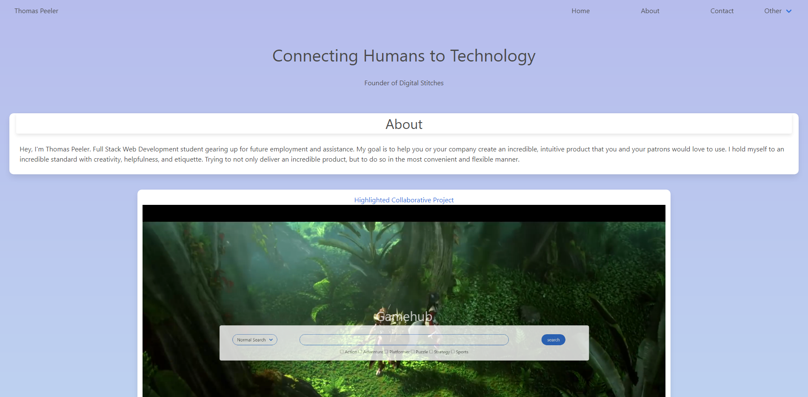

# new-portfolioHW

The purpose of this assignment was to create an updated portfolio with links to more contact information, cleaner UI

## Getting Started

I started a fresh repo and started generating all my files, then I started making a wireframe and highlighting the positioning and elements that I wanted. Then I started making basic shapes using divs and column classes from Bulma and adding additional functionality (dropdowns, navbar items, footers, cards, etc)

### Prerequisites

In order to accomplish the goal of this assignment, I had to use VSCode for the HTML and CSS as well as the Bulma framework for styling. I used github and gitbash to communicate my repo from my local machine to the server side repo.

### Solving

The solve of this assignment was basically just designing a website with the proper links and elements to display work. Now that I have access to using frameworks for design I feel more confident in my ability to create the things that I can imagine in my head and I understand my tools much better, especially thanks to the 12 column grid system.

## Technologies Used

* [HTML](https://developer.mozilla.org/en-US/docs/Web/HTML)
* [CSS](https://developer.mozilla.org/en-US/docs/Web/CSS)
* [Bulma](https://bulma.io/)

## Deployed Link

* [https://tmpeeler.github.io/new-portfolioHW/](#)

## Picture of website currently deployed

;

## Authors

* **Thomas Peeler** 

- [https://github.com/TMPeeler/new-portfolioHW]

## Acknowledgments

* I made a lot of progress during this assignment and the work from the last project definitely carried over confidence wise.